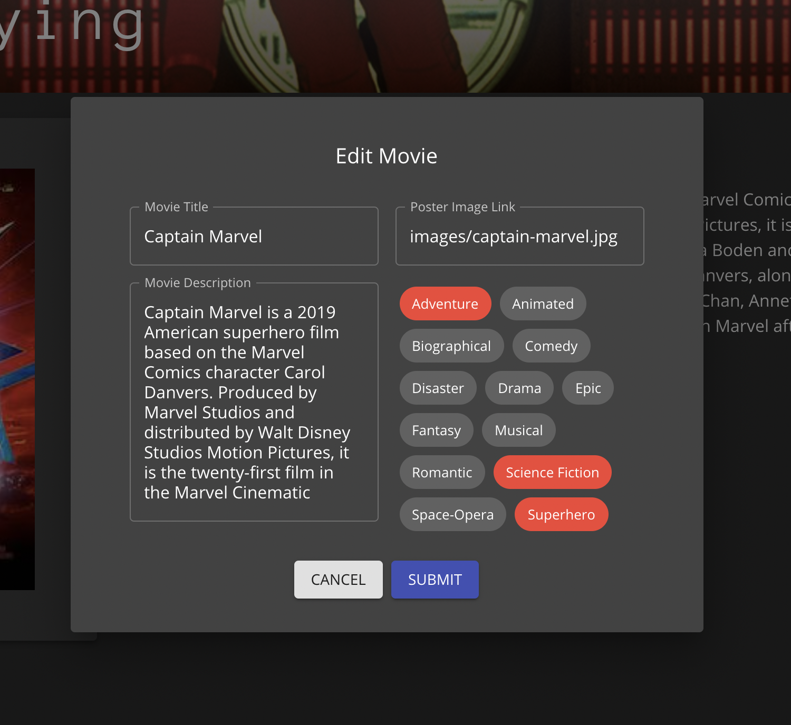

# MOVIE SAGAS

## Description

_Duration: Weekend Assignment_

This project was a culmination of a lot of study at Prime. It included working with React, Redux-Saga, Material-UI, React-Router, SQL, and more. It was the most challenging app to create to date.

Our main points of study this week were working with Redux-Saga and many-to-many tables in SQL. Here, we had three tables total: a movie table, genre table, and movie_genre junction table. The most challenging problem I faced was sending multiple genres / movie value pairs into the junction table, which was eventually done through concatenating a query string that contained all the sanitized values I needed.

We displayed the list of movies, and used client side routing to show individual details when the movie poster is clicked. Movies can also be added and edited. When editing, the information for the movie populates the "edit movie" pop-up dialog.

## Screen Shots

- Landing Page 
- Movie Gallery 
- Edit Movie 

## Prerequisites

- [Node.js](https://nodejs.org/en/)
- [Postgres](https://www.postgresql.org/download/)

## Installation

1. Create a database named `saga_movies_weekend`.
2. The queries for creating the database table are in `database.sql`. The project is built on [Postgres](https://www.postgresql.org/download/), so you will need to make sure to have that installed. We recommend using Postico to run those queries as that was used to create the queries.
3. Open up your editor of choice and run an `npm install`.
4. Run `npm run server` in your terminal.
5. Run `npm run client` in your terminal, which will open a new browser tab for you.

## Usage

This is an application to display, add, and edit movies in a collection. 

Click "ADD MOVIE" to open a pop-up dialog where you can add a new movie title, description, URL to a poster image, and click the genres the movie belongs in.

Click on a movie poster to see additional information about each movie. Click on "EDIT MOVIE" to open a dialog populated with the movie's information, which can be edited and submitted.

## Built With

- React
- React Router
- Redux-Saga
- Material-UI
- Node.js
- Express
- Postgres

## Acknowledgement

Thanks to [Prime Digital Academy](www.primeacademy.io) who equipped and helped me to make this application a reality.

## Support

If you have suggestions or issues, please [email me](percburk@gmail.com)!

